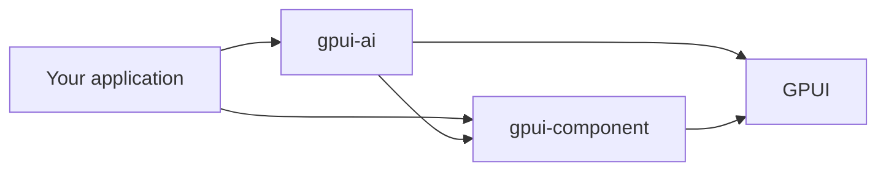

# gpui-ai

UI components for AI applications built with [GPUI](https://gpui.rs).

gpui-ai covers streamed responses, tool calls, approvals, chat, prompt input, context usage, and tables. It builds on [gpui-component](https://github.com/longbridge/gpui-component) and uses its active theme. Your application owns model requests, retries, storage, and long-lived state.

[Live components](https://labcoder.github.io/gpui-ai/components/) · [API docs](https://labcoder.github.io/gpui-ai/api/gpui_ai/) · [Themes](https://labcoder.github.io/gpui-ai/themes/) · [Changelog](CHANGELOG.md)

## How it fits



gpui-ai composes gpui-component controls and uses GPUI for custom components. Components render the state you pass in and emit typed events keyed by your IDs.

## Install

Install gpui-ai from Git. Its current GPUI dependencies are not all available on crates.io.

```toml
[dependencies]
gpui-ai = { git = "https://github.com/labcoder/gpui-ai", tag = "v0.5.0" }
gpui = { git = "https://github.com/zed-industries/zed" }
gpui-component = { git = "https://github.com/longbridge/gpui-component" }
gpui_platform = { git = "https://github.com/zed-industries/zed", features = ["font-kit", "x11", "wayland", "runtime_shaders"] }
```

Pin `gpui-ai` with a tag or revision. Leave `gpui` without a `rev` so Cargo uses the same source as gpui-component. Each release records the matching gpui-component and Zed revisions in [CHANGELOG.md](CHANGELOG.md).

## Quick start

Call `gpui_ai::init(cx)` during application setup and wrap the top-level view in `gpui_component::Root`. The [gallery source](crates/gallery/src/gallery.rs) shows each component in a complete window.

<details>
<summary>Stateless and stateful examples</summary>

Stateless components implement `RenderOnce`. Build them where you render them:

```rust
use gpui_ai::prelude::*;

ToolChip::new("edit", "Edit main.rs").status(ToolStatus::Running)
```

Stateful components are GPUI entities. Keep the entity and its subscriptions in your application state:

```rust
use gpui_ai::prelude::*;

let prompt = cx.new(|cx| PromptBar::new("agent-prompt", window, cx));
let _subscription = cx.subscribe(&prompt, |_, _, event: &PromptBarEvent, _| {
    println!("prompt event: {event:?}");
});
```

</details>

## Components

The [live catalog](https://labcoder.github.io/gpui-ai/components/) contains all 35 components with source code and live WebAssembly demos. The catalog groups them into:

- responses, progress, code, and diffs
- tools, plans, approvals, and tasks
- chat, prompts, attachments, and conversation history
- search, context, tables, navigation, and utility controls

<details>
<summary>View all 35 components</summary>

| Component | Kind | What it does |
|---|---|---|
| [`LoadingState`](https://labcoder.github.io/gpui-ai/components/loading/) | stateless | Loader with shimmer and elapsed time |
| [`Orbs`](https://labcoder.github.io/gpui-ai/components/orbs/) | stateless | Dot-lattice activity indicator with five animations |
| [`StatusBadge`](https://labcoder.github.io/gpui-ai/components/status/) | stateless | One status pill for every lifecycle, swapping states in a fixed slot |
| [`Thinking`](https://labcoder.github.io/gpui-ai/components/thinking/) | stateless | Collapsible reasoning trace for running and completed work |
| [`StreamingText`](https://labcoder.github.io/gpui-ai/components/streaming-text/) | stateless | Streaming Markdown with citations, sources, and follow-up prompts |
| [`CodeBlock`](https://labcoder.github.io/gpui-ai/components/code-block/) | stateless | Syntax-highlighted code with copy and streaming states |
| [`CodeDiff`](https://labcoder.github.io/gpui-ai/components/code-diff/) | stateless | Unified diff viewer with per-hunk accept and reject events |
| [`ToolChip`](https://labcoder.github.io/gpui-ai/components/tool-chips/) | stateless | Compact tool and file-edit status |
| [`ToolCall` / `ToolGroup`](https://labcoder.github.io/gpui-ai/components/tool-calls/) | stateless | Collapsible tool input, output, errors, approvals, and grouped calls |
| [`TaskRow`](https://labcoder.github.io/gpui-ai/components/tasks/) | stateless | Agent task status from `TaskSnapshot` data |
| [`TodoList`](https://labcoder.github.io/gpui-ai/components/todos/) | stateless | Task list with progress |
| [`ImageGeneration`](https://labcoder.github.io/gpui-ai/components/image-generation/) | stateless | Image-generation progress |
| [`SearchResults`](https://labcoder.github.io/gpui-ai/components/search/) | stateless | Web search result cards |
| [`ApprovalCard`](https://labcoder.github.io/gpui-ai/components/approval/) | stateless | Approval request with allow, deny, and resolved states |
| [`PlanCard`](https://labcoder.github.io/gpui-ai/components/plan/) | stateless | Proposed plan with step status and approval actions |
| [`RecommendationCard`](https://labcoder.github.io/gpui-ai/components/recommendation/) | stateless | Recommendation with a confidence meter |
| [`ContextCard`](https://labcoder.github.io/gpui-ai/components/context/) | stateless | Retrieved context with sources |
| [`InsightCard`](https://labcoder.github.io/gpui-ai/components/insights/) | stateless | Paged insights with sparkline charts |
| [`PromptBar`](https://labcoder.github.io/gpui-ai/components/prompt-bar/) | entity | Composer with mentions, commands, model selection, and attachments |
| [`VoiceControls`](https://labcoder.github.io/gpui-ai/components/voice/) | stateless | Dictation and speech state with typed events |
| [`MessageQueue`](https://labcoder.github.io/gpui-ai/components/queue/) | stateless | Queued prompts with move, edit, send, remove, and clear actions |
| [`Chat`](https://labcoder.github.io/gpui-ai/components/chat/) | entity | Virtualized transcript and composer with editing, branches, attachments, and unread state |
| [`Suggestions`](https://labcoder.github.io/gpui-ai/components/suggestions/) | stateless | Prompt suggestion chips with stable IDs |
| [`AttachmentStrip` / `AttachmentPreview`](https://labcoder.github.io/gpui-ai/components/attachments/) | stateless | Attachments with thumbnails, upload state, and typed events |
| [`ArtifactPanel`](https://labcoder.github.io/gpui-ai/components/artifact/) | stateless | Generated documents and code with previews, source, versions, and actions |
| [`ContextMeter`](https://labcoder.github.io/gpui-ai/components/context-meter/) | stateless | Context usage as a ring, bar, or text |
| [`CommandSearch`](https://labcoder.github.io/gpui-ai/components/command-search/) | entity | Command palette with filtering and keyboard navigation |
| [`SidebarNav`](https://labcoder.github.io/gpui-ai/components/sidebar-nav/) | entity | Collapsible, searchable workspace navigation |
| [`ThreadList`](https://labcoder.github.io/gpui-ai/components/thread-list/) | entity | Grouped conversation list with search, archive, rename, and delete actions |
| [`FineTuneCard`](https://labcoder.github.io/gpui-ai/components/fine-tune/) | entity | Design property editor for size, radius, opacity, and typeface |
| [`SelectionActions`](https://labcoder.github.io/gpui-ai/components/selection-actions/) | entity | Selection actions for asking, explaining, and rewriting |
| [`RecordsTable`](https://labcoder.github.io/gpui-ai/components/records-table/) | entity | Virtualized, sortable data grid |
| [`DiffTable`](https://labcoder.github.io/gpui-ai/components/diff-table/) | entity | Proposed edits over tabular data |
| [`FilterTable`](https://labcoder.github.io/gpui-ai/components/filter-table/) | entity | Filterable, reorderable table |
| [`ComparisonTable`](https://labcoder.github.io/gpui-ai/components/comparison-table/) | entity | Feature comparison matrix |

</details>

Components use `Progressive<T>` and `ProgressState` for streamed work. Stateful controls expose typed events; stateless controls use fluent builders.

## Themes

Every component reads gpui-component theme tokens. The gallery includes 55 themes, and the [themes page](https://labcoder.github.io/gpui-ai/themes/) lets you preview or download each JSON file.

## Requirements

| | |
|---|---|
| Rust | 1.89 or newer |
| Platforms | macOS, Linux, and Windows |
| Linux setup | Run [`script/install-linux.sh`](script/install-linux.sh) once |
| Web gallery | A browser with WebGPU support |

## Run the gallery

```sh
git clone https://github.com/labcoder/gpui-ai
cd gpui-ai
cargo run -p gallery
```

Use `npm run dev:web` for the browser host. See [CONTRIBUTING.md](CONTRIBUTING.md) for setup and checks.

## License

[MIT](LICENSE)
